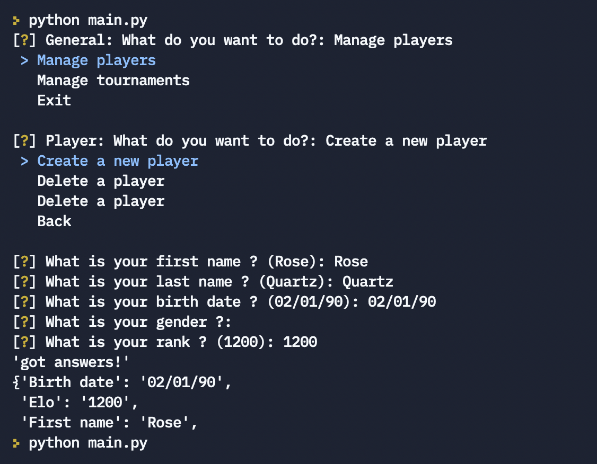

# oc-py-p4

Openclassroom Python path - project 4

## Resources

* [Python regex to match dates](https://stackoverflow.com/questions/4709652/python-regex-to-match-dates)
* [Python Tuple](https://www.programiz.com/python-programming/tuple)
* [How to convert a string to a date in Python](https://stackoverflow.com/questions/4709652/python-regex-to-match-dates)
* [How to create a GUID/UUID in Python](https://stackoverflow.com/questions/534839/how-to-create-a-guid-uuid-in-python)
* [Python DOC - UUID objects according to RFC 4122](https://docs.python.org/3/library/uuid.html)
* [Wikipedia - Chess rating system](https://en.wikipedia.org/wiki/Chess_rating_system)
